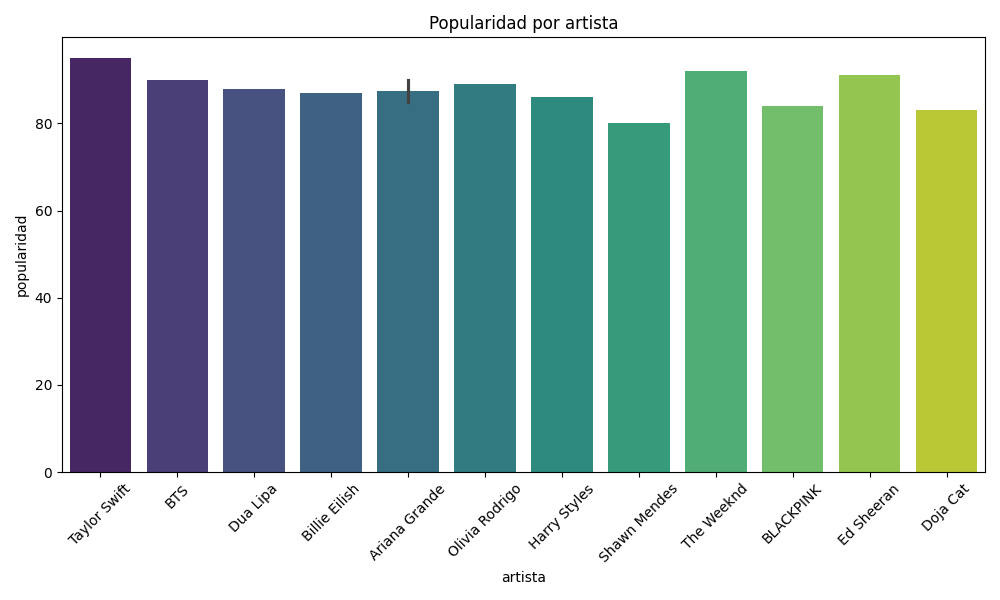

# ANALISIS DE ALBUMES POP EN INGLES
En este proyecto se analiza un conjunto de albumes pop en ingles usando Python. Analizamos la popularidad de cada Artista, cuantas canciones
hay por albumy cuantos lanzamientos hubo por año.

## ARCHIVOS INCLUIDOS
- albumes.pop.csv - Dataset con informacion de los artistas, albumes, duracion, canciones y popularidad.
- analisis.py - Codigo en Python que genera graficos y estadisticas del dataset.
- README.md - Este archivo.

## TECNOLOGIAS USADAS
- Python
- Pandas
- Matplotlib
- Seaborn

## Como ejecutar este proyecto
1. Asegurate de tener Python actualizado o instalado.
2. Instala las librerias necesarias usando el comando: pip install pandas matplotlib seaborn
3. Ejecuta el archivo analisis.py, y apareceran los graficos con el analisis de los albumes prevamiente añadidos.

## Ejemplo de grafico generado

---

Creado por [henryydata](https://github.com/henryydata)

